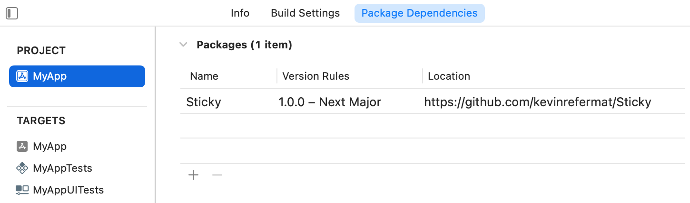

# Sticky 


Sticky makes building your app on Core Data easier. It provides an enhanced `PersistentContainer` that makes testing simpler, statically typed CRUD functions for `NSManagedObject`, and Swifty ways of accessing and working with `NSManagedObjectContext`.

## Installation

### Swift Package Manager

To install Sticky for use in an app, add Sticky to your Package Dependencies in Xcode.



To install Sticky for use in a Swift Package Manager-powered tool, add Sticky as a dependency to your `Package.swift` file. 

```swift
dependencies: [
    .package(url: "https://github.com/kevinrefermat/Sticky", .upToNextMajor(from: "1.0.0"))
]
```

For more information, see the [Swift Package Manager documentation](https://github.com/apple/swift-package-manager/tree/master/Documentation).

## Usage

### Instantiate Your Core Data Stack

`PersistentContainer` encapsulates your Core Data stack. Instantiating `PersistentContainer` will load your data model but will not load your persistent stores.

#### Basic

The simplified instantiation works well if your data model is a member of your application target.

```swift
let persistentContainer = PersistentContainer(name: "MyDataModel")
```

#### Advanced

If your project contains multiple targets or your data model is a member of an external framework, it may be necessary to manually load and inject your `NSManagedObjectModel`.

```swift
let persistentContainer = PersistentContainer(
    name: "MyDataModel",
    managedObjectModel: .mergedModel(
        from: [
            Bundle(for: type(of: self))
        ]
    )
)
```

### Load Your Persistent Stores

Initialize your Core Data stack by calling `start()`. This will load the persistent stores and perform any work necessary for your app to access your persisted data. There is a synchronous and asynchronous version of `start()`.

Upon success, both `start()` functions return an instance of `ContextProvider`, which is used by your app to create and access fully initialized instances of `NSManagedObjectContext`.

**Note:** During app initialization, it can be hard to guarantee that contexts are only used after the Core Data stack is fully and successfully initialized. Sticky helps avoid this issue by exclusively providing contexts from `ContextProvider`. `ContextProvider` does not have a public initializer and is not made available to your app until `PersistentContainer` is fully and successfully initialized. In this way, Sticky statically guarantees that your app will only be able to use contexts that are ready to be accessed.

#### Synchronous

The synchronous `start()` function is the simplest way to initialize your `PersistentContainer`.

```swift
do {
    let contextProvider = try persistentContainer.start()
    // use contextProvider to build Core Data dependent object graph
} catch {
    ...
}
```

#### Asynchronous

The asynchronous `start()` function has the advantage offloading the work to a background queue, thus freeing up the calling thread. 

This could be useful in cases where there is computationally expensive work to be done, such as a database migration, that you don't want to block the main queue for.

```swift
persistentContainer.start() { result in
    switch result {
    case .success(let contextProvider):
        // use contextProvider to build Core Data dependent object graph
    case .failure(let error):
        ...
    }
}
```

### CRUD Functions

#### Create

Create an instance of a certain type. 

**Note:** Core Data provides `NSManagedObject.init(context:)` to instantiate subclasses of `NSManagedObject`. However, there is an implementation detail that may cause warnings/errors when running unit tests. See this [StackOverflow question](https://stackoverflow.com/questions/51851485/multiple-nsentitydescriptions-claim-nsmanagedobject-subclass/53498777) for what the warnings/errors look like and this [answer](https://stackoverflow.com/a/53498777) to see how to safely avoid the issue. The `create()` function below uses the method outlined in the aforementioned answer to safely avoid the issue.

```swift
try contextProvider.newBackgroundContext().perform { context in
    let book = try context.create(Book.self)
    ...
}
```

#### Fetch

Fetch all managed objects of a certain type.

```swift
try contextProvider.newBackgroundContext().perform { context in
    let books = try context.fetch(Book.self)
    ...
}
```

Fetch all managed objects of a certain type with a block to customize the fetch request. The fetch request will have the generic type and entity corresponding to the specified `NSManagedObject` subclass.

```swift
try contextProvider.newBackgroundContext().perform { context in
    let historyBooks = try context.fetch(Book.self) { request in
        request.predicate = NSPredicate(
            format: "genre = %@", "history"
        )
    }
    ...
}
```

#### Delete

Delete all managed objects of a certain type.

```swift
try contextProvider.newBackgroundContext().perform { context in
    try context.delete(Book.self)
    ...
}
```

Delete all managed objects of a certain type with a block to customize the fetch request for objects to delete.

```swift
try contextProvider.newBackgroundContext().perform { context in
    try context.delete(Book.self) { (request) in
        request.predicate = NSPredicate(format: "genre == history")
    }
    ...
}
```

### Enhanced `perform(block:)` and `performAndWait(block:)`

#### `NSManagedObjectContext` is passed into `block`

This allows you to avoid an unnecessary declaration of `context` outside the scope of `block`.

**Note:** `perform(block:)` retains the receiving context until `block` returns.

```swift
contextProvider.newBackgroundContext().perform { context in
    ...
}

contextProvider.newBackgroundContext().performAndWait { context in
    ...
}
```

#### `performAndWait(block:)` rethrows errors

This matches the rethrowing behavior of [`DispatchQueue.sync()`](https://developer.apple.com/documentation/dispatch/dispatchqueue/2016081-sync).

```swift
do {
    try contextProvider.newBackgroundContext().performAndWait { context in
        try context.doSomethingThatThrows()
    }
} catch {
    // handle errors thrown by context.doSomethingThatThrows()
}
```

#### `performAndWait(block:)` returns the value returned by `block`

This matches the return behavior of [`DispatchQueue.sync()`](https://developer.apple.com/documentation/dispatch/dispatchqueue/2016081-sync).

```swift
let bookTitles = try contextProvider.newBackgroundContext().performAndWait { context in
    return try context.fetch(Book.self).map(\.title)
}
```

## Testing

### Fast Unit Tests

Instantiate `PersistentContainer` with `inMemory` set to `true` to make your Core Data tests run as fast as possible. This also ensures that your tests run in an isolated environment without any persisted state from previous runs.

```swift
let persistentContainer = PersistentContainer(
    name: "MyDataModel", 
    inMemory: true
)
```

```swift
let persistentContainer = PersistentContainer(
    name: "MyDataModel",
    managedObjectModel: .mergedModel(
        from: [
            Bundle(for: type(of: self))
        ]
    ),
    inMemory: true
)
```

### Simulate First Time Launch

Sticky provides two ways to simulate a first time launch without actually uninstalling and reinstalling the app.

#### Delete the persistent stores

The most straightforward way to test a first time launch experience is to delete the underlying database and kill the app. The next time your app is launched, it will have to create a new database as if it's the first time it's launched.

```swift
try persistentContainer.deleteSQLLiteStores()
```

#### Launch the app with in memory persistent stores

Instead of deleting the stores on disk, you can instantiate the `PersistentContainer` with the `inMemory` flag set to `true`. When the persistent stores are loaded the `PersistentContainer` will ignore the stores on disk and will instead create and use a new store in memory. As this new store will be in memory, it won't outlive the app process. 

When you are finished testing the first time launch experience, you can initialize the `PersistentContainer` with the `inMemory` flag set back to `false` and use your preserved on-disk persistence.

```swift
let persistentContainer = PersistentContainer(name: "MyDataModel", inMemory: true)
```

#### Practical consideration

Both of the above methods are most conveniently used by building a debug setting into your app. Add a button to delete the on-disk persistence and a switch to toggle `inMemory` when initializing `PersistentContainer`. 

For the `inMemory` switch, the state will need to be persisted outside of Core Data (`UserDefaults` for example) so that this state is available to your app on next launch.

### Customizable Behavior of `PersistentContainer`

Make your app depend on `PersistentContainerProtocol` instead of `PersistentContainer`. Then create a mock object that conforms to `PersistentContainerProtocol` to simulate edge cases in your app or behavior that is hard to replicate in the real world.

Want to simulate a scenario where loading the persistent stores failes? Create a mock object that conforms to `PersistentContainerProtocol` that throws an error inside `start()`.

Want to simulate a slow data migration? Create a new object that wraps `PersistentContainer` and inside `start()` have it sleep for a while before calling the underlying `start()`.
